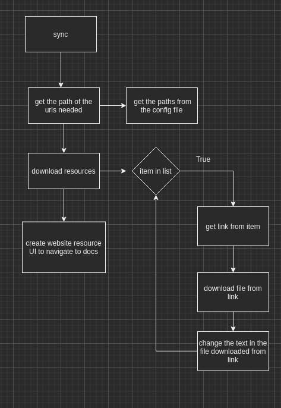

# Hugo Syncer

A handy python script to sync Hugo-friendly Markdown files from multiple repostiories into a Hugo website project.

This script originated from [Tekton's docs sync script](https://github.com/tektoncd/website/tree/main/sync),
with modifications to make the sync script general purpose.

## `sync`

This `sync` script allows synchronizing contents from specified GitHub repositories in the `--config` directory
to any Hugo-based project.

To run this script locally, set up a Python 3 environment and execute
the script:

```bash
python3 -m venv .venv
source .venv/bin/activate    
pip3 install -r requirements.txt
./sync/sync.py
```

### Usage

```bash
       USAGE: sync.py [flags]
flags:

sync.py:
  -c,--config: Config directory
    (default: 'config')

Try --helpfull to get a list of all flags.
```

### Configuring Directories

The config directory should include the configuration for syncing/curating contents from
specific Tekton repositories.

See `pipelines.yaml` and `triggers.yaml` for more instructions. These two
YAML files control the synchronization/curation from the `tektoncd/pipeline`
and `tektoncd/triggers` repositories respectively.

The YAML files here are used by the scripts in `../sync`.

The yaml sync file requires the following schema

```yaml
# Each YAML file under sync/ configures how sync/sync.py synchronizes
# contents of various versions from its source of truth (usually a GitHub
# repository of a Tekton component, such as tektoncd/pipelines) to
# content/ (for the lastest version) and vault/ (for earlier versions).

# The name of the component.
# sync.py will use this value to build directories in content/ and vault/. This is used to for the list on the redenred web website.
component: Foobar
# The order of the component.
displayOrder: 0
# The GitHub repository where documentation resides.
repository: https://github.com/tektoncd/foobar
# The directory in the GitHub repository where contents reside.
docDirectory: docs
# The link to the GitHub tag page.
archive: https://github.com/tektoncd/foobar/tags
# The tags (versions) of contents to sync.
# Note that sync.py and related script reads tags in the order specified in
# the following list; the first entry in tags will automatically become the
# latest version of contents.
# To add a new version, append to the list as below
#- name: v0.8.2
#  displayName: v0.8.x
#  files:
#  - myfiles.md: myfiles.md
tags:
  # The name of the tag in the GitHub repository.
- name: master
  # The name to display on tekton.dev.
  # sync.py will use this value in the version switcher and other places.
  displayName: master
  # Dict of folders to sync
  files:
    foo.md : bar.md
```

### Mental Model

This is a quick diagram that will help you develop a mental model on how the sync works.



## Running with Docker

To build the docker file

**Note: If you trying running the container without supplying a config directory it will fail. Only copy specific values instead of the entire directory. We're primarily trying to avoid pulling in config/, since it's confusing thatit will not be used.**

```bash
# You must cd into the correct directory to build the image
docker build -t tekton/web sync/.
```

## License

Copyright 2021 Adam B Kaplan

Copyright 2020 The Tekton Authors

Licensed under the Apache License, Version 2.0 (the "License");
you may not use this file except in compliance with the License.
You may obtain a copy of the License at

   http://www.apache.org/licenses/LICENSE-2.0

Unless required by applicable law or agreed to in writing, software
distributed under the License is distributed on an "AS IS" BASIS,
WITHOUT WARRANTIES OR CONDITIONS OF ANY KIND, either express or implied.
See the License for the specific language governing permissions and
limitations under the License.